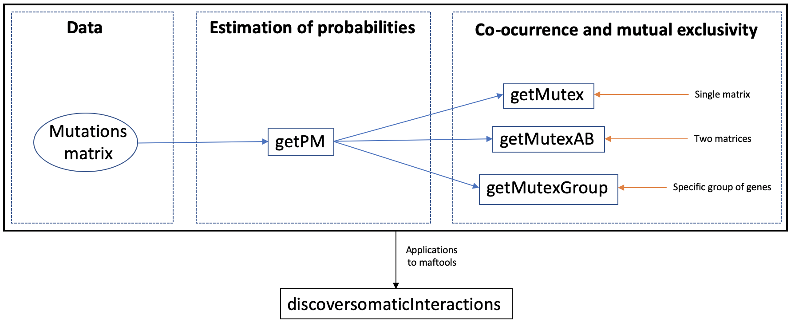
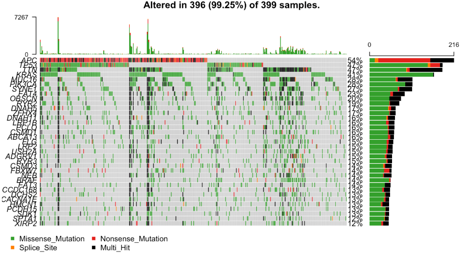
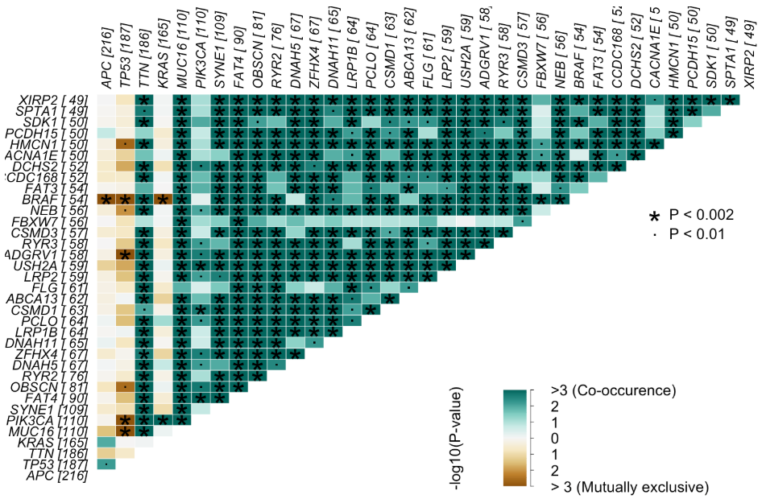
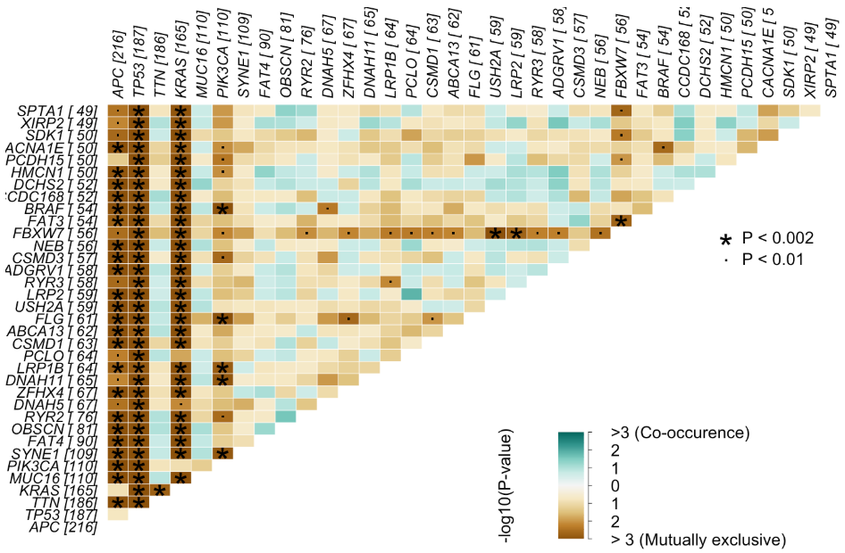

```{r LoadFunctions, echo=FALSE, message=FALSE, warning=FALSE, results='hide'}
library(knitr)
opts_chunk$set(error = FALSE)
library(Rediscover)
library(dplyr)
library(kableExtra)
library(maftools)
library(TCGAbiolinks)
library(parallel)
```

```{r style, echo = FALSE, results = 'asis'}
##BiocStyle::markdown()
```

# Installation
Rediscover can be installed from CRAN repository:

```{r, eval=FALSE}

install.packages("Rediscover")

```

# Introduction

The package library has two main parts: 

* Estimation of the probabilities $p_ {ij}$ that gene *i* is mutated in sample *j* -assuming conditional independence between genes and samples-.
* Estimation of p-values using the Poisson-Binomial distribution, using the previous probabilities and the number of samples in which two genes are co-mutated. The corresponding null hypothesis $H_0$ is that the mutational status of both genes is independent of each other. 



Figure 1 is a flowchart that depicts *Rediscover* pipeline.  Given a binary matrix of genes x samples where a 1 will appear if gene *i* is mutated in sample *j* and 0 otherwise, `getPM` function estimates the probabilities $p_{ij}$ of the gene *i* being mutated in sample *j*. The input matrix could be `matrix` or `Matrix class`. Usually, mutations stored in `Matrix class` are a sparse object and therefore, require less memory to store them. 

The second step is the estimation of the p-values using these probabilities and the number of samples where two genes are co-altered. *Rediscover* offers different functions depending on the desired study:

* **`getMutex`** if the user wants to evaluate if genes are mutually exclusive.
* **`getMutexAB`** if the user wants to evaluate if genes are mutually exclusive with respect to another event (amplifications, deletions, etc...)
* **`getMutexGroup`** will be used when the user wants to obtain the probability that a certain group of genes being mutually exclusive. Unlike the `getMutex` function, in this case the users introduces the set of genes of interest. 


*Rediscover* also provides a function to integrate its usage with <a href="https://bioconductor.org/packages/release/bioc/html/maftools.html" target="_blank"> `maftools`</a> and <a href="https://www.bioconductor.org/packages/release/bioc/html/TCGAbiolinks.html" target="_blank">`TCGAbiolinks`</a>. Specifically, we added to the function `somaticInteractions` from `maftools` our analyses based on the Poisson-Binomial distribution resulting in a new function called **`discoversomaticInteractions`**.


# Estimation of the probabilities

Given a binary matrix A with the mutation information, `getPM` estimates the probabilities $p_{ij}$ of the gene *i* being mutated in sample *j*. To make the package more memory efficient, we created an `S4 class` object called `PMatrix` that gives access to the values of the resulting probability matrix.

The required input for this function is:

* **A:** The binary matrix with the mutation information.

The following code chunk shows an example of how to perform this function:

```{r getPM_matrix, eval=TRUE}

data("A_example")

PMA <- getPM(A_example)
PMA[1:4,1:4]

```

As already mentioned, `getPM` allows matrices of class `matrix` as depicted on previous example. But this functions also supports matrices of type `Matrix`. The following code chunk shows the same example but using a matrix of class `Matrix`.

```{r getPM_, eval=TRUE}

data("A_Matrix")
class(A_Matrix)
PMA <- getPM(A_Matrix)
PMA[1:4,1:4]

```

Finally, the next code chunk shows an example of applying this function to a real case. Specifically, information available in *The Cancer Genome Atlas Program (TCGA)* on *colon adenocarcinoma (COAD)* has been used.

```{r getPM_COAD, eval=TRUE}

data("TCGA_COAD")
PM_COAD <- getPM(TCGA_COAD)

```

# Perform Co-ocurrence and mutually exclusive test

From the probability matrix and the number of samples in which two genes are co-mutated, p-values can be estimated using the Poisson-Binomial distribution. That is, the probability of two genes being mutually exclusive is obtained. The p-values obtained are stored in a `Matrix` class in order to be memory efficient.

*Rediscover* offers different functions depending on the desired study:

## Using a single matrix

We can perform the mutual exclusivity test for all pairs of genes of a single matrix using the `getMutex` function.
The inputs of `getMutex` are:

* **A:**	The binary matrix with the mutation information.
* **PM:**	The corresponding probability matrix of A that can be computed using function `getPM`. By default is equal to `getPM(A)`.
* **lower.tail** True if mutually exclusive test. False for co-ocurrence. By default is TRUE.
* **verbose**	The verbosity of the output. By default is FALSE

The following code chunk shows an example of how to perform this function:

```{r getMutex_matrix, eval=TRUE}

data("A_example")

PMA <- getPM(A_example)

mymutex <- getMutex(A=A_example,PM=PMA)

```

As in the previous case, an example is shown when using matrices of class Matrix.

```{r getMutex_Matrix, eval=TRUE}

data("A_Matrix")

PMA_Matrix <- getPM(A_Matrix)

mymutex <- getMutex(A=A_Matrix,PM=PMA_Matrix)

```


Finally, as in the previous case, an example of how to apply this function to a real case has been carried out. Specifically, information available in *The Cancer Genome Atlas Program (TCGA) on colon adenocarcinoma (COAD)* has been used.


```{r getMutex_COAD, eval=TRUE}

data("TCGA_COAD")
data("PM_COAD")

COAD_mutex <- getMutex(TCGA_COAD, PM_COAD)

```


Moreover, there are some extra inputs that if user want to use the **exact formula of the Poison-Binomial distribution**: 

* **mixed**	option to compute lower p.values with an exact method. By default FALSE
* **th:**	upper threshold of p.value to apply the exact method.
* **parallel**	If the exact method is executed with a parallel process.

If the **mixed** parameter is set to `TRUE` the exact p.value is computed for p.values lower that the upper threshold (the parameter **th**). I.e. if mixed option is selected and th is set to 1, all the p.values are computed with the exact formula. The following code chunk shows performs the previous test but applying the exact method for p.values lower than 0.001.

```{r getMutex_COAD_exact, eval=TRUE}
data("TCGA_COAD")
data("PM_COAD")
COAD_mutex_exact <- getMutex(TCGA_COAD, PM_COAD,mixed = TRUE,th = 0.001)
```


## Using two matrices

The second option is using two matrices. As in the first case, it is also necessary to enter the previously obtained probability matrix in addition to the initial matrix. But, unlike the previous case, an extra matrix B is used which has the same shape as matrix A, but may contain additional information, such as gene amplifications *i* in samples *j*. In this way, it will be necessary to enter both probability matrices in addition to the initial matrices. In the case where this function is applied directly, `getMutex` allows not to enter the probability matrices, since it would be calculated internally in order to use this function. 

Therefore, the inputs required by `getMutexAB` are:

* **A:**	The binary matrix of events A.
* **PMA:** 	The corresponding probability matrix of A that can be computed using function `getPM`. By default is equal to `getPM(A)`.
* **B:**	The binary matrix of events B.
* **PMB:**	The corresponding probability matrix of B that can be computed using function `getPM`. By default is equal to `getPM(B)`.

In addition, in this case there are also some extra possible entries that have been previously defined, but could be modified by the user: 

* **lower.tail**	True if mutually exclusive test. False for co-ocurrence. By default is TRUE.
* **mixed** 	option to compute lower p.values with an exact method. By default TRUE.
* **th:**	upper threshold of p.value to apply the exact method.
* **verbose**	The verbosity of the output.
* **parallel**	If the exact method is executed with a parallel process.

Continuing with the example, in this case the result will not be a matrix with the probability that genes being mutually exclusive, but rather a matrix with the probability that genes being amplified. The following code chunk shows an example of how to perform this function:

```{r getMutexAB_matrix, eval=TRUE}

data("A_example")
data("B_example")

PMA <- getPM(A_example)
PMB <- getPM(B_example)

mismutex <- getMutexAB(A=A_example, PM=PMA, B=B_example, PMB = PMB)

```

As in the previous cases, the following code chunk shows an example when using matrices of class Matrix.

```{r getMutexAB_Matrix, eval=TRUE}

data("A_Matrix")
data("B_Matrix")

PMA <- getPM(A_Matrix)
PMB <- getPM(B_Matrix)

mismutex <- getMutexAB(A=A_Matrix, PM=PMA, B=B_Matrix, PMB = PMB)

```

Finally, the next code chunk shows an example of how to apply this function to a real case. Specifically, information available in The Cancer Genome Atlas Program (TCGA) on colon adenocarcinoma (COAD) has been used. In this case, the extra matrix B provides information about the amplifications present in different samples and two matrices (TCGA_COAD_AMP and AMP_COAD) with the same size have been constructed.

```{r getMutexAB_COAD, eval=TRUE}

data("TCGA_COAD_AMP")
data("AMP_COAD")
data("PM_TCGA_COAD_AMP")
data("PM_AMP_COAD")

mismutex <- getMutexAB(A=TCGA_COAD_AMP, PMA=PM_TCGA_COAD_AMP, 
                       B=AMP_COAD, PMB = PM_AMP_COAD)

```


## Using a specific group of genes

Finally, the last option requires, as in the first case, a single matrix and the obtained probability matrix. As explained before, in this case a reduced version of the original matrix is introduced, i.e., starting from the original matrix, a specific group of genes and samples are selected. On the other hand, the probability matrix required for this study will be taken from the global probability matrix, i.e., the global probability matrix is first calculated by introducing the original matrix with all genes and all samples and then only the probabilities of the specifically selected genes and samples are chosen. Therefore, a matrix will be introduced that will contain a series of genes and samples from the original matrix, with their corresponding probabilities obtained from the global probability matrix.

In addition, unlike the other functions, this one allows to determine: 

* **Coverage:** sample in which **at least one gene** is mutated. The null hypothesis H0 is that if they are mutually exclusive they are highly dispersed.
* **Exclusivity:** sample in which **only one gene** is mutated. The null hypothesis H0 is that if they are mutually exclusive, there will be more samples in which only one of the genes is mutated.
* **Impurity:** samples in which **at least two or more genes** are mutated. The null hypothesis H0 is that if they are mutually exclusive there will be few samples with two or more mutated genes.

Therefore, the inputs required by `getMutexGroup` are:

* **A:**	The binary matrix.
* **PM:**	The corresponding probability matrix of A that can be computed using function `getPM`.
* **type:** one of Coverage, Exclusivity or Impurity. By default is Impurity.

Furthermore, there is also an extra possible entry that has been previously defined, but could be modified by the user: 

* **lower.tail** True if mutually exclusive test. False for co-ocurrence. By default is TRUE.

The following code chunk shows an example of how to perform this function:


```{r getMutexGroup_example, eval=TRUE}
data("A_example")

A2 <- A_example[,1:40]
A2[1,1:10] <- 1
A2[2,1:10] <- 0
A2[3,1:10] <- 0
A2[1,11:20] <- 0
A2[2,11:20] <- 1
A2[3,11:20] <- 0
A2[1,21:30] <- 0
A2[2,21:30] <- 0
A2[3,21:30] <- 1

PM2 <- getPM(A2)
A <- A2[1:3,]
PM <- PM2[1:3,]
```

The next figure is a graphical representation of A, showing a matrix of 3 genes with mutations in some of samples (black areas). 

```{r getMutexGroup_image, eval=TRUE, echo=FALSE}
image(Matrix(A)) # These two genes are mutually exclusive (to a certain extent)
```

Following, `getMutexGroup` function has been used introducing the generated A matrix and performing three different studies; first one analyses the impurity, second one the coverage and last one the exclusivity.  

```{r getMutexGroup_studies, eval=TRUE}
getMutexGroup(A, PM, "Impurity")
getMutexGroup(A, PM, "Coverage")
getMutexGroup(A, PM, "Exclusivity")

```


# Application of *Rediscover* to maftools

Among the possible applications of *Rediscover* stands up the possibility of representing graphically the results obtained by applying `discoverSomaticInteractions` function. In this case, maftools has been used in Colon Adenocarcinoma (COAD) and different plots have been performed to study the results obtained, which has allowed the study of co-ocurring and mutually exclusive genes. 

```{r maftools_COAD, echo=TRUE, eval=FALSE, message=FALSE, warning=FALSE, results='hide'}
coad.maf <- GDCquery_Maf("COAD", pipelines = "muse") %>% read.maf
```

Figure 3 shows the mutations contained in genes in each sample, with missesense mutations being the most common, although, nonsense mutations are noteworthy, as 54% of the samples are mutated in APC, which contains a large percentage of nonsense mutations.

```{r oncoplot_COAD, echo=TRUE, eval=FALSE, message=FALSE, warning=FALSE}
oncoplot(coad.maf, top = 35)
```



Analyzing Figure 3, it can be seen that there are samples with a high number of mutations, which indicates the presence of hypermutated samples. Specifically, there are samples with more than 7000 mutations, and focusing on them, it can be seen that there are three samples in particular with a large number of mutations, but, even though they are hypermutated, not all genes contain a mutation in that sample. In particular, looking at the second and third peaks, it is observed that most of genes are mutated, but there are a few that are not, which makes them very interesting. Specifically, TP53, which has 47% mutations, is not mutated in two of the most hypermutated samples.

Furthermore, looking at the pattern of mutations, it could be predicted that APC, TP53 and TTN and KRAS are mutually exclusive, as it is observed that there are areas in which one of the genes is mutated but the rest are not.

Next, to further deepen the analysis obtained from the oncoplot, Somatic Interactions plots were made, which determines the co-occurrence and mutual exclusivity between genes. Specifically, two plots have been carried out the first one using the function provided by the *discover* package, i.e. `somaticInteractions`, an the second one using the last of the functions created in *Rediscover* package; `discoversomaticInteractions`. 

Figure 4 shows the result when applying `somaticInteractions` function and it can be seen that most of genes are co-occurrent. 

```{r somInter_COAD, echo=TRUE, eval=FALSE, message=FALSE, warning=FALSE, results='hide'}
somaticInteractions(maf = coad.maf, top = 35, pvalue = c(1e-2, 2e-3))
```



However, Figure 5 shows the result when applying `discoversomaticInteractions` function. It is observed that the result is very different from the previous one, as in this case more mutually exclusive genes appear.

```{r discsomInter_COAD, echo=TRUE, eval=FALSE, message=FALSE, warning=FALSE, results='hide'}
discoversomaticInteractions(maf = coad.maf, top = 35, pvalue = c(1e-2, 2e-3))
```



The reason why this difference exists is because, as mentioned, there are samples that are hypermutated, so most genes are mutated, and therefore they are all co-ocurring with each other, when in fact they are not.

Analyzing Figure 5, it can be seen that:

* TP53 is mutually exclusive to all genes present in this study in a highly significant way, in contrast to the figure obtained with the `somaticInteractions` function where the significance was minimal and practically nil. 
* KRAS is mutually exclusive to most of genes, excluding two where there is also mutual exclusivity but its statistical significance is lower.
* APC is mutually exclusive to many of genes present in this study.

Finally, analyzing the similarities between the two Somatic Interaction figures at the same time, the following conclusions can be drawn:

* BRAF is mutually exclusive with APC, TP53 and KRAS and it is noteworthy that this information coincides in both figures.
* In addition to BRAF, TP53 is also mutually exclusive with ADGRV1, PIK3CA and MUC16.

Therefore, analyzing all these conclusions, it is obtained that, as predicted by the oncoplot analysis, APC, TP53, TTN and KRAS are mutually exclusive. But, genes that seem co-occurrent when applying `somaticInteractions`, in reality are not and that is demonstrated when applying `discoversomaticInteractions`. 


# References

* Ferrer-Bonsoms Juan A., Jareno Laura, and Rubio Angel 'Rediscover: an R package to identify mutually exclusive mutations.' submitted.

* Canisius, Sander, John WM Martens, and Lodewyk FA Wessels. "A novel independence test for somatic alterations in cancer shows that biology drives mutual exclusivity but chance explains most co-occurrence." Genome biology 17.1 (2016): 1-17.

* Antonio Colaprico, Tiago Chedraoui Silva, Catharina Olsen, Luciano Garofano, Claudia Cava, Davide Garolini, Thais Sabedot, Tathiane
  Malta, Stefano M. Pagnotta, Isabella Castiglioni,Michele Ceccarelli, Gianluca Bontempi Houtan Noushmehr. TCGAbiolinks: An
  R/Bioconductor package for integrative analysis of TCGA data Nucleic Acids Research (05 May 2016) 44 (8): e71.
  
* Silva, Tiago C., et al. "TCGA Workflow: Analyze cancer genomics and epigenomics data using Bioconductor packages." F1000Research 5
  (2016).
  
* Mounir, Mohamed, et al. "New functionalities in the TCGAbiolinks package for the study and integration of cancer data from GDC and
  GTEx." PLoS computational biology 15.3 (2019): e1006701.
  
* Mayakonda A, Lin DC, Assenov Y, Plass C, Koeffler HP. 2018. Maftools: efficient and comprehensive analysis of somatic variants in
  cancer. Genome Research. http://dx.doi.org/10.1101/gr.239244.118

# Session Information
```{r}
sessionInfo()
```


